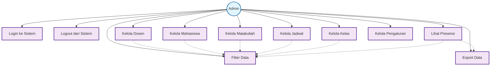
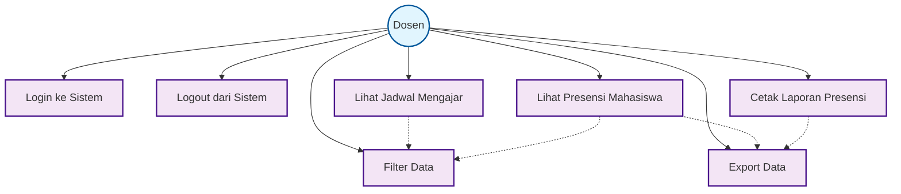
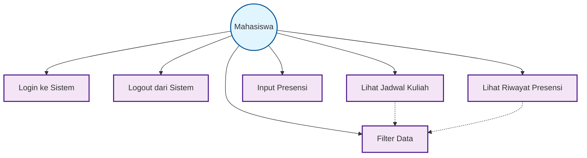
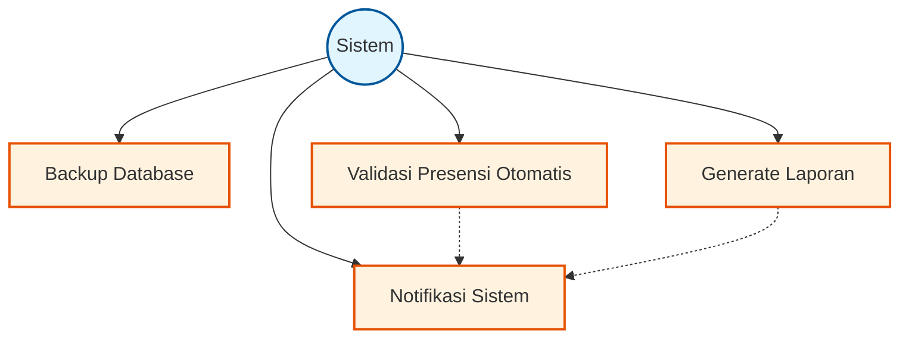
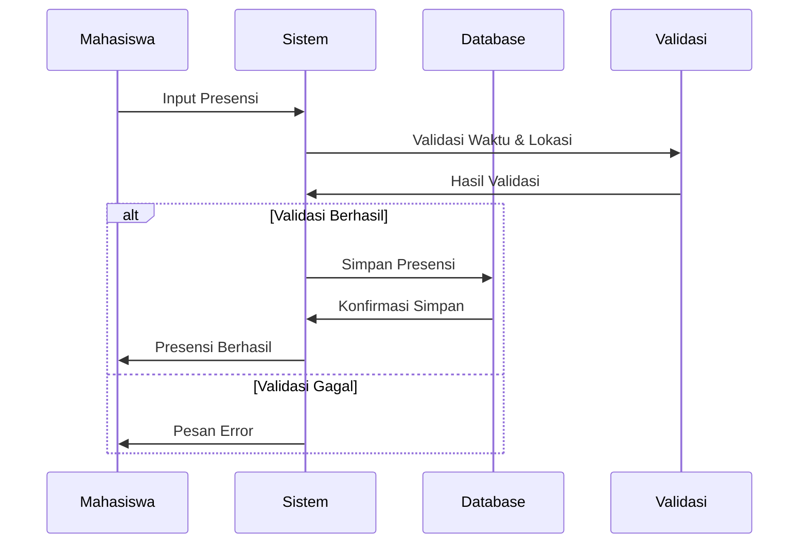
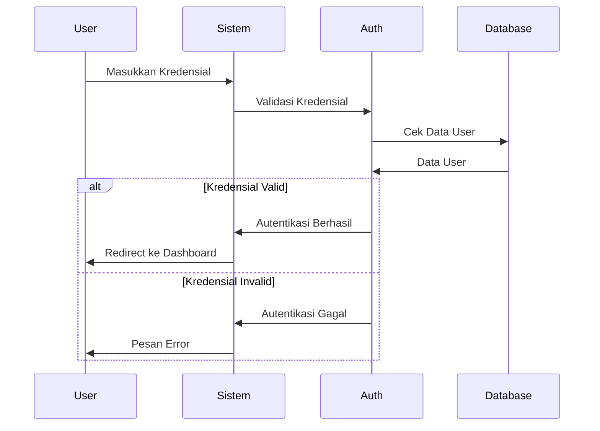

# USE CASE DIAGRAM SISTEM INFORMASI AKADEMIK (SIA)

## Diagram Utama - Semua Aktor dan Use Case

```mermaid
graph TB
    %% Aktor
    Admin((Admin))
    Dosen((Dosen))
    Mahasiswa((Mahasiswa))
    Sistem((Sistem))
    
    %% Use Case Manajemen Akun
    Login[Login ke Sistem]
    Logout[Logout dari Sistem]
    
    %% Use Case Admin
    KelolaDosen[Kelola Dosen]
    KelolaMahasiswa[Kelola Mahasiswa]
    KelolaMatakuliah[Kelola Matakuliah]
    KelolaJadwal[Kelola Jadwal]
    KelolaKelas[Kelola Kelas]
    LihatPresensiAdmin[Lihat Presensi]
    KelolaPengaturan[Kelola Pengaturan]
    
    %% Use Case Dosen
    LihatJadwalDosen[Lihat Jadwal Mengajar]
    LihatPresensiDosen[Lihat Presensi Mahasiswa]
    CetakLaporan[Cetak Laporan Presensi]
    
    %% Use Case Mahasiswa
    LihatJadwalMahasiswa[Lihat Jadwal Kuliah]
    InputPresensi[Input Presensi]
    LihatRiwayatPresensi[Lihat Riwayat Presensi]
    
    %% Use Case Sistem
    BackupDB[Backup Database]
    ValidasiPresensi[Validasi Presensi Otomatis]
    GenerateLaporan[Generate Laporan]
    
    %% Use Case Tambahan
    FilterData[Filter Data]
    ExportData[Export Data]
    Notifikasi[Notifikasi Sistem]
    
    %% Hubungan Admin
    Admin --> Login
    Admin --> Logout
    Admin --> KelolaDosen
    Admin --> KelolaMahasiswa
    Admin --> KelolaMatakuliah
    Admin --> KelolaJadwal
    Admin --> KelolaKelas
    Admin --> LihatPresensiAdmin
    Admin --> KelolaPengaturan
    Admin --> FilterData
    Admin --> ExportData
    
    %% Hubungan Dosen
    Dosen --> Login
    Dosen --> Logout
    Dosen --> LihatJadwalDosen
    Dosen --> LihatPresensiDosen
    Dosen --> CetakLaporan
    Dosen --> FilterData
    Dosen --> ExportData
    
    %% Hubungan Mahasiswa
    Mahasiswa --> Login
    Mahasiswa --> Logout
    Mahasiswa --> LihatJadwalMahasiswa
    Mahasiswa --> InputPresensi
    Mahasiswa --> LihatRiwayatPresensi
    Mahasiswa --> FilterData
    
    %% Hubungan Sistem
    Sistem --> BackupDB
    Sistem --> ValidasiPresensi
    Sistem --> GenerateLaporan
    Sistem --> Notifikasi
    
    %% Include/Extend Relationships
    InputPresensi -.-> ValidasiPresensi
    LihatPresensiDosen -.-> GenerateLaporan
    CetakLaporan -.-> GenerateLaporan
    
    %% Styling
    classDef actor fill:#e1f5fe,stroke:#01579b,stroke-width:2px
    classDef useCase fill:#f3e5f5,stroke:#4a148c,stroke-width:2px
    classDef systemUseCase fill:#fff3e0,stroke:#e65100,stroke-width:2px
    
    class Admin,Dosen,Mahasiswa,Sistem actor
    class Login,Logout,KelolaDosen,KelolaMahasiswa,KelolaMatakuliah,KelolaJadwal,KelolaKelas,LihatPresensiAdmin,KelolaPengaturan,LihatJadwalDosen,LihatPresensiDosen,CetakLaporan,LihatJadwalMahasiswa,InputPresensi,LihatRiwayatPresensi,FilterData,ExportData useCase
    class BackupDB,ValidasiPresensi,GenerateLaporan,Notifikasi systemUseCase
```



## Diagram Detail - Admin



## Diagram Detail - Dosen



## Diagram Detail - Mahasiswa



## Diagram Detail - Sistem



## Diagram Alur Presensi



## Diagram Alur Login



## Keterangan Diagram

### **Aktor:**
- **Admin** - Pengelola sistem dengan akses penuh
- **Dosen** - Pengajar yang dapat melihat jadwal dan presensi
- **Mahasiswa** - Peserta kuliah yang dapat input presensi
- **Sistem** - Proses otomatis yang berjalan di background

### **Use Case Utama:**
1. **Manajemen Akun** - Login/Logout untuk semua aktor
2. **CRUD Admin** - Kelola semua entitas (Dosen, Mahasiswa, Matakuliah, Jadwal, Kelas)
3. **Fitur Dosen** - Lihat jadwal mengajar dan presensi mahasiswa
4. **Fitur Mahasiswa** - Input presensi dan lihat jadwal
5. **Sistem Otomatis** - Backup, validasi, dan generate laporan

### **Relasi:**
- **Include** (garis putus-putus) - Use case yang selalu dipanggil
- **Extend** (garis putus-putus) - Use case opsional yang dapat dipanggil

### **Warna:**
- **Biru** - Aktor
- **Ungu** - Use Case User
- **Oranye** - Use Case Sistem
``` 
